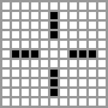

康威生命游戏(Conway's Game of Life)，又称康威生命棋，是英国数学家 约翰·何顿·康威(John Horton Conway) 在1970发明的**细胞自动机**。  

## 生命游戏

生命游戏是一个零玩家游戏，它的进化由它的初始状态决定，不需要进一步的输入。观察者通过创建一个初始状态并观察它如何演变来与生命游戏交互。它是图灵完备的，可以模拟通用构造函数或任何其他图灵机器。  

生命游戏包括一个二维矩形世界，这个世界中的每个方格都有且仅有两种可能的状态 -- 细胞存活或细胞死亡。每个细胞与其八个相邻的细胞相互作用，分别是水平、垂直和对角相邻的细胞。当时间每进行一步，都会发生以下转变：  
- 任何少于两个活邻居的活细胞都会死亡。
- 任何有两个或三个活邻居的活细胞都会延续到下一代。
- 任何有三个以上活邻居的活细胞都会死亡。
- 任何有三个活邻居的死细胞都会变成活细胞。

据以上规则，每个细胞在下一刻的生死取决于自身以及周围八个细胞的状态。过多和过少的邻居都可以导致活细胞死亡，因此玩家应该设定合适的细胞数目才能保证细胞群的生存。

在游戏的过程中，杂乱无序的细胞可以演化出精致有序的结构，而已经成型的结构也有可能受到其他外部细胞的的“入侵”而被破坏。

有序的包括稳定状态、振荡状态等。其中振荡状态是一种动态平衡，可以在原区域保持不动，也可以移动。

上面提到康威生命游戏是图灵完备的，这意味着它理论上能够做到图灵机能够做到的所有事情，可以解决所有可计算问题。

